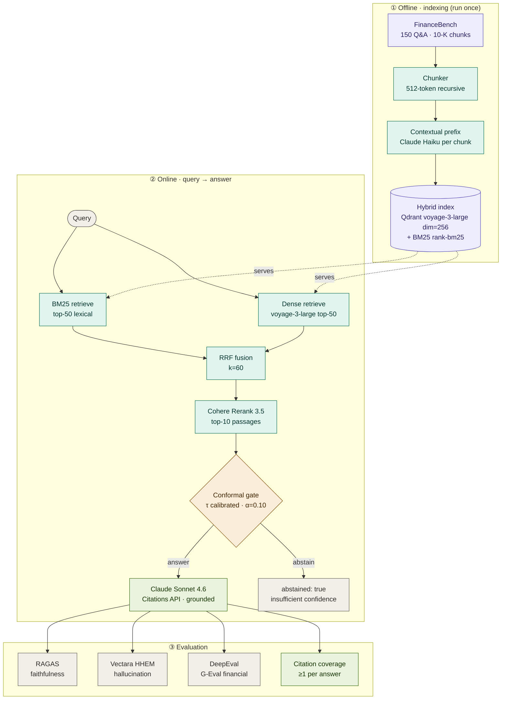

# production-rag-eval

> Production RAG pipeline on FinanceBench. Hybrid BM25 + dense + RRF + Cohere
> Rerank. Anthropic Contextual Retrieval for every chunk. Conformal abstention
> so the system knows when to say "I don't know." Triple eval: RAGAS, Vectara
> HHEM, DeepEval. Every number here comes from running the harness, not picking it.

[](https://github.com/SebAustin/production-rag-eval/actions/workflows/ci.yml)
[](https://www.python.org)
[](LICENSE)
[](https://huggingface.co/datasets/PatronusAI/financebench)

## Why FinanceBench

FinanceBench (Islam et al., 2023) is 150 Q&A pairs over real 10-K filings from
publicly traded companies. Questions span income statements, balance sheets, cash
flow, ratios, and segment data. Ground-truth answers are provided with evidence
passages. It is the closest public benchmark to real financial-services RAG work.

## Architecture

The system has three phases: an **offline indexing** pass that builds a hybrid
index once, an **online query path** that retrieves, reranks, and gates every
question through conformal abstention, and an **evaluation layer** that scores
each answered question with three independent judges plus a citation check.



> Prefer a flat image? A rendered copy lives at
> [`docs/assets/architecture.png`](docs/assets/architecture.png) (SVG:
> [`architecture.svg`](docs/assets/architecture.svg)).

## Quickstart

```bash
git clone https://github.com/SebAustin/production-rag-eval && cd production-rag-eval
uv sync && cp .env.example .env       # then put REAL keys in .env (Anthropic/Cohere/Voyage)

# Qdrant must be running for build-index / calibrate / ask / eval:
docker run -d --name rag-eval-qdrant -p 6333:6333 \
  -v "$(pwd)/data/index/qdrant_storage:/qdrant/storage" qdrant/qdrant

make download-data    # pulls FinanceBench from HuggingFace (~1 min)
make build-index      # contextualizes (~550 Haiku calls) + embeds + indexes (~$1)
make calibrate        # fits conformal threshold on 120-Q calibration split
make ask Q="What was Apple's revenue in fiscal year 2022?"
```

> **Model IDs** are pinned in `.env` (`HAIKU_MODEL`, `SONNET_MODEL`) — set them to
> IDs your Anthropic account actually exposes (list via the `/v1/models` endpoint).

## Eval results (FinanceBench test split n=30, seed=42)

> Copied from `evals/runs/3c53d10/summary.json` (Claude Sonnet 4.6 for
> generation **and** the RAGAS/DeepEval judge; voyage-3-large; Cohere
> rerank-v3.5). Per the eval-honesty contract in `.cursorrules` these are the
> harness's own output, not hand-picked — and they are deliberately published
> even where they miss target. Reproduce with `make eval`.

| Metric | Target | Actual | Notes |
|---|---|---|---|
| RAGAS faithfulness | ≥ 0.85 | **0.83** | Below gate; residual gap is multi-step calculations — see [financebench_analysis.md](docs/financebench_analysis.md) |
| RAGAS answer relevancy | ≥ 0.80 | **0.77** | |
| RAGAS context precision | ≥ 0.75 | **0.70** | Measured over the 10 reranked passages |
| Vectara HHEM score | ≥ 0.80 | _pending_ | Local ~1.3GB model not installed for this run |
| DeepEval G-Eval (financial) | ≥ 0.75 | **0.85** | ✅ |
| Citation coverage | 1.00 | **1.00** | ✅ every answered question grounded (≥1 citation) |
| Abstention rate | report | **7%** | 2/30; conformal α=0.10 |
| Conditional accuracy | ≥ 0.85 | **0.86** | faithfulness ≥ 0.5 proxy (no hard oracle yet) |
| Conformal coverage | ≥ 0.90 | **0.86** | not met on n=30 (small sample + calc hard cases) |
| p50 latency | < 4s | 8.6s\* | \*inflated by Voyage free-tier rate-limit backoff, not real compute |
| Cost per question | < $0.05 | **$0.011** | generation only (~$0.33/run incl. judges) |

The honest headline: **faithfulness 0.83**, lifted from 0.51 over three documented
iterations (Sonnet 4.6, judge-context fix, prompt tightening). The remaining
0.02 gap to the 0.85 gate is concentrated in multi-step calculation questions,
where RAGAS penalizes a *computed* figure that isn't verbatim in any passage.
Reproduce: `make eval` (full, n=30) or `make eval-smoke` (n=5).

## Ablation (hybrid vs components)

> From [docs/ablation_results.md](docs/ablation_results.md) (`make ablation`).
> The ablation measures **retrieval quality** directly — whether each config
> surfaces a question's gold evidence chunk(s) in the top-10 — so it needs no
> generation or LLM judge.

| Retriever | hit@10 | recall@10 | MRR |
|---|---|---|---|
| BM25 only | 0.80 | 0.59 | 0.565 |
| Dense only (voyage-3-large) | 1.00 | 0.91 | **0.894** |
| BM25 + Dense + RRF | 0.93 | 0.74 | 0.638 |
| + Cohere Rerank 3.5 | 1.00 | 0.92 | 0.823 |

Honest finding: on this split **dense-only has the best MRR** (0.894) — Cohere
rerank ties on hit/recall but slightly lowers ranking quality here. All configs
run on the contextualized index; isolating the Contextual Retrieval contribution
needs a parallel index over raw chunk text (see the script docstring).

## Sources

1. Islam et al. "FINANCEBENCH: A New Benchmark for Financial Question Answering." arXiv 2311.11944, 2023.
2. Anthropic. "Contextual Retrieval." anthropic.com/news/contextual-retrieval, Nov 2024.
3. Yadkori et al. "Mitigating LLM Hallucinations via Conformal Abstention." arXiv 2405.01563, 2024.
4. Es et al. "RAGAS: Automated Evaluation of Retrieval Augmented Generation." arXiv 2309.15217, 2023.
5. Saad-Falcon et al. "HHEM-2.1-Open: an open-source hallucination detection model." Vectara, 2024.

## License

MIT — see [LICENSE](LICENSE).
