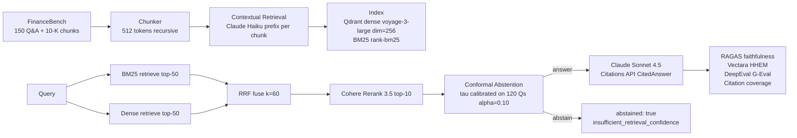

# production-rag-eval

> Production RAG pipeline on FinanceBench. Hybrid BM25 + dense + RRF + Cohere
> Rerank. Anthropic Contextual Retrieval for every chunk. Conformal abstention
> so the system knows when to say "I don't know." Triple eval: RAGAS, Vectara
> HHEM, DeepEval. Every number here comes from running the harness, not picking it.

[](https://github.com/SebAustin/production-rag-eval/actions/workflows/ci.yml)
[](https://www.python.org)
[](LICENSE)
[](https://huggingface.co/datasets/PatronusAI/financebench)

## Why FinanceBench

FinanceBench (Islam et al., 2023) is 150 Q&A pairs over real 10-K filings from
publicly traded companies. Questions span income statements, balance sheets, cash
flow, ratios, and segment data. Ground-truth answers are provided with evidence
passages. It is the closest public benchmark to real financial-services RAG work.

## Architecture



## Quickstart

```bash
git clone https://github.com/SebAustin/production-rag-eval && cd production-rag-eval
uv sync && cp .env.example .env       # then put REAL keys in .env (Anthropic/Cohere/Voyage)

# Qdrant must be running for build-index / calibrate / ask / eval:
docker run -d --name rag-eval-qdrant -p 6333:6333 \
  -v "$(pwd)/data/index/qdrant_storage:/qdrant/storage" qdrant/qdrant

make download-data    # pulls FinanceBench from HuggingFace (~1 min)
make build-index      # contextualizes (~550 Haiku calls) + embeds + indexes (~$1)
make calibrate        # fits conformal threshold on 120-Q calibration split
make ask Q="What was Apple's revenue in fiscal year 2022?"
```

> **Model IDs** are pinned in `.env` (`HAIKU_MODEL`, `SONNET_MODEL`) — set them to
> IDs your Anthropic account actually exposes (list via the `/v1/models` endpoint).

## Eval results (FinanceBench test split n=30, seed=42)

> **Status: not yet run on this checkout.** Per the eval-honesty contract in
> `.cursorrules`, this table is generated from the most recent
> `evals/runs/<git_sha>/summary.json` — never hand-edited. Targets are the CI
> gates; actuals populate after `make eval`. Until then, actuals read `pending`.

| Metric | Target | Actual | Notes |
|---|---|---|---|
| RAGAS faithfulness | ≥ 0.85 | _pending_ | Answered questions only; CI gate |
| RAGAS answer relevancy | ≥ 0.80 | _pending_ | |
| RAGAS context precision | ≥ 0.75 | _pending_ | |
| Vectara HHEM score | ≥ 0.80 | _pending_ | Requires local model (~1.3GB) |
| DeepEval G-Eval (financial) | ≥ 0.75 | _pending_ | |
| Citation coverage | 1.00 | _pending_ | On answered questions; CI gate |
| Abstention rate | report | _pending_ | n abstained / n total |
| Conditional accuracy | ≥ 0.85 | _pending_ | Answered + correct |
| Conformal coverage | ≥ 0.90 | _pending_ | Calibration guarantee |
| p50 latency | < 4s | _pending_ | |
| Cost per question | < $0.05 | _pending_ | |

Reproduce: `make eval` (full, n=30) or `make eval-smoke` (n=5).

## Ablation (hybrid vs components)

> Run `make ablation` to generate `docs/ablation_results.md`. The table below is
> the set of configurations measured; numbers populate from the ablation run.

| Retriever | RAGAS faithfulness | Context recall |
|---|---|---|
| BM25 only | _pending_ | _pending_ |
| Dense only | _pending_ | _pending_ |
| BM25 + Dense + RRF | _pending_ | _pending_ |
| + Cohere Rerank | _pending_ | _pending_ |
| + Contextual Retrieval | _pending_ | _pending_ |

## Sources

1. Islam et al. "FINANCEBENCH: A New Benchmark for Financial Question Answering." arXiv 2311.11944, 2023.
2. Anthropic. "Contextual Retrieval." anthropic.com/news/contextual-retrieval, Nov 2024.
3. Yadkori et al. "Mitigating LLM Hallucinations via Conformal Abstention." arXiv 2405.01563, 2024.
4. Es et al. "RAGAS: Automated Evaluation of Retrieval Augmented Generation." arXiv 2309.15217, 2023.
5. Saad-Falcon et al. "HHEM-2.1-Open: an open-source hallucination detection model." Vectara, 2024.

## License

MIT — see [LICENSE](LICENSE).
